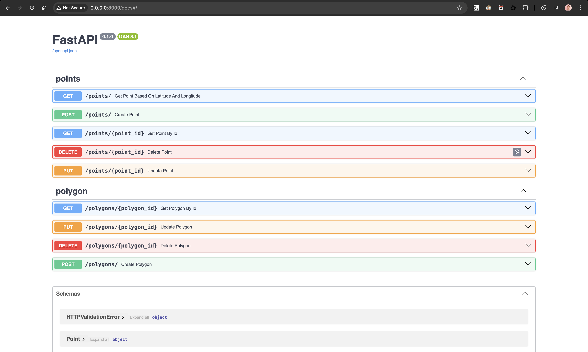
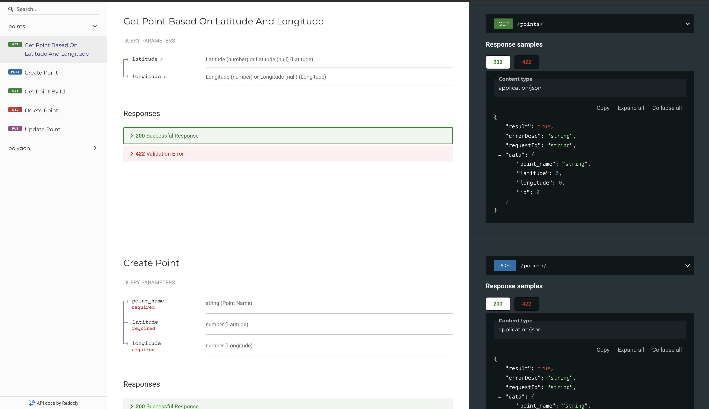

# Spatial Data Platform API

A backend API service for storing, updating, and retrieving spatial data (points and polygons) using FastAPI and PostGIS.

## Features

- REST API for spatial data operations
- Support for storing, updating, and retrieving point data
- Support for storing, updating, and retrieving polygon data
- Uses PostGIS for efficient spatial queries
- Dockerized for easy deployment

## Tech Stack

- **Backend**: FastAPI (Python)
- **Database**: PostgreSQL with PostGIS extension
- **Containerization**: Docker & Docker Compose

## Project Structure

```
.
├── app/                    # Application code
│   ├── api/                # API endpoints
│   │   ├── points.py       # Points API endpoints
│   │   ├── polygons.py     # Polygons API endpoints
│   ├── models/             # Database models
│   │   ├── point.py        # Point data model
│   │   ├── polygon.py      # Polygon data model
│   │   └── response.py     # Response data model
│   ├── services/           # Business logic
│   │   ├── point_service.py    # Point CRUD operations
│   │   └── polygon_service.py  # Polygon CRUD operations
│   ├── repository/         # Database connection and repository files for points and polygons
│   └── main.py             # **Application entry point**
|   └── di.py               # Dependency Injectory
|   └── config.py           # Config of the Application
├── docker/                 # Docker configuration
│   ├── postgis/           # Postgis initialization files
│   │   └── init-postgis.sql # PostGIS initialization script
│   └── python/              # Python initialization (if applicable)
├── docker-compose.yml      # Docker Compose configuration
├── pyproject.toml          # Project metadata and dependencies
└── README.md               # Project documentation
```

## Installation & Setup

### Prerequisites

- Docker and Docker Compose

### Running with Docker

1. Clone the repository:

```bash
git clone <repository-url>
```

2. Start the services using Docker Compose:

```bash
docker-compose up -d
```

3. API documentation is available at http://localhost:8000/docs

4. Run Apis by clicking on "Try it out".


## API Endpoints

### Points API

#### Endpoints

- `GET /points`: Retrieve points with latitude and longitude
- `GET /points/{id}`: Retrieve a specific point by ID
- `POST /points`: Create a new point
- `PUT /points/{id}`: Update an existing point
- `DELETE /points/{id}`: Delete a point

### Polygon API

#### Endpoints
- `GET /polygons/{id}`: Retrieve a specific polygon by ID
- `POST /polygons`: Create a new polygon
- `PUT /polygons/{id}`: Update an existing polygon
- `DELETE /polygons/{id}`: Delete a polygon

#### Screenshots






### Demo


[Download Screen Recording](assets/Recording.mov)


<video width="640" height="360" controls>
    <source src="assets/Recording.mov" type="video/quicktime">
    Your browser does not support the video tag.
</video>